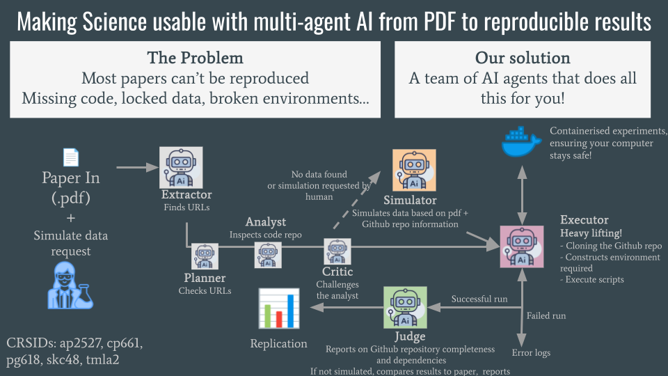

# PaperRun


This repository provides an automated, multi-agent framework powered by AG2 to bridge the gap between AI research papers and code reproducibility. It orchestrates a specialized pipeline of autonomous agents to discover codebases, analyze environment requirements, and execute experiments with human oversight.

The workflow is structured as follows:

**1. Discovery & Audit**
- Executor: Extracts links and official implementation details from paper PDF/text inputs. Organize links into code and data repositories. Output .json file, .md file and log file. 
- Planner : Checks URL
- Analyst : Inspect code repository
- Critic : Challenges analyst
  
**2. Simulate data** 
- Simulator: Uses the paper and Github repository to simulate artifical data.

**3. Execution**
- Executor: Operates in a secure container to git clone, parse imports to reconstruct missing environments (beyond requirements.txt), and execute scripts. Reports error logs. 

**4. Verification**
- Judge: Reports on Github repository completeness and dependencies. If not simulated data, report results and compare to paper.

### Prerequisites
- Python 3.10+
- AG2 (AutoGen)
- Docker (Recommended for the Runner Agent)
- OpenAI API Key (or supported LLM provider)

### Clone the repository
```
git clone https://github.com/your-username/ag2-paper-repro.git
cd ag2-paper-repro
```

### Installation
```
git clone https://github.com/your-username/PaperRoute.git
cd PaperRoute
pip install -r requirements.txt
```

### Usage 
```
python main.py --paper "https://arxiv.org/pdf/xxxx.xxxx.pdf"
```

### Outputs
- Environment Log: A record of all dependencies installed.
- Execution Trace: Full logs of the code run.
- Judge Report: A comparison table of Original Paper Results vs. Your Results.
